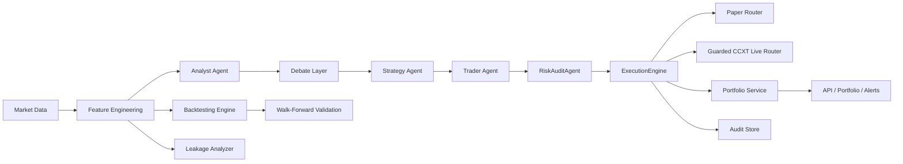

# Pepper

[](https://github.com/NANIEXISTS/pepper/actions/workflows/ci.yml)


Production-oriented AI trading platform focused on safe build order, explainable decisions, leakage-aware research, and risk-gated execution.

The repository now contains the implementation layers for:

- Phase 1: data, config, persistence, API, risk-gated execution
- Phase 2: deterministic features, EMA baseline, walk-forward backtesting, leakage checks
- Phase 3: portfolio state, alerts, paper-trading cycle orchestration
- Phase 4: analyst, debate, strategy, and trader agents
- Phase 5: execution-timing RL primitives and policy hooks
- Phase 6 foundation: guarded ccxt live-router with capability checks and sandbox support

Phase 6 is not operationally complete yet. The code path exists, but the real-world safety gates still require verified paper-trading duration and live capital ramp-up.

## Why this repo exists

Most "AI trading bot" projects fail for predictable reasons:

- they skip risk controls
- they trust biased backtests
- they blur research code with production code
- they let strategy logic leak into data ingestion
- they add live trading long before paper trading is trustworthy

Pepper is structured to avoid those failures by default.

## What it does today

- Serves a FastAPI backend with market-data, feature, backtest, paper-order, portfolio, alert, and paper-cycle endpoints
- Normalizes market data asynchronously
- Computes deterministic bar-close features
- Runs leakage-aware backtests with walk-forward validation
- Tracks portfolio cash, equity, positions, and daily PnL anchor
- Executes every order through a mandatory `RiskAuditAgent`
- Stores audit records for trade decisions and execution outcomes
- Runs a multi-agent paper-trading loop with explainable debate traces
- Exposes a guarded live-routing foundation through ccxt without enabling live trading by default

## System view



## Safety model

The repo is built around a few hard rules:

- No order should exist outside `ExecutionEngine.place_order()`
- No trade should bypass `RiskAuditAgent.run()`
- No backtest should be trusted without leakage checks and walk-forward evaluation
- No live trading should be enabled before paper-trading gates pass in the real world
- RL may affect execution timing, not market direction

## Repo layout

```text
config.yaml                 Runtime settings
docs/                       Architecture and repo operating rules
scripts/                    Local helper scripts
tests/                      Automated tests
trading_ai/
  agents/                   Analyst, debate, strategy, and trader agents
  alerts/                   Alert history service
  api/                      FastAPI app
  backtesting/              Baseline strategy, leakage checks, walk-forward backtests
  core/                     Shared enums and typed models
  data/                     Async market-data providers and normalization
  execution/                Routers and risk-gated execution engine
  features/                 Deterministic feature engineering
  llm/                      Optional LLM client layer
  orchestration/            Paper-trading orchestration
  portfolio/                Portfolio accounting
  persistence/              Audit logging and DB models
  reinforcement/            Execution-timing environment and policy hooks
  risk/                     Risk policy enforcement
```

## Quick start

### 1. Install

```powershell
python -m pip install -e .[dev]
```

### 2. Run tests

```powershell
python -m pytest -q
```

### 3. Start the API

```powershell
python -m trading_ai.main
```

### 4. Useful helper scripts

```powershell
.\scripts\bootstrap.ps1
.\scripts\test.ps1
.\scripts\run-api.ps1
.\scripts\clean.ps1
```

## API surface

| Endpoint | Purpose |
|---|---|
| `GET /health` | service health and mode |
| `GET /config` | effective runtime summary |
| `GET /market-data/{symbol}` | normalized OHLCV preview |
| `GET /features/{symbol}` | latest engineered features |
| `GET /backtests/ema/{symbol}` | EMA baseline backtest plus walk-forward summary |
| `POST /orders/paper` | manual paper order through the execution engine |
| `POST /paper/cycles/{symbol}` | full multi-agent paper-trading cycle |
| `GET /portfolio` | current portfolio state |
| `GET /alerts` | recent operator alerts |

## Current verification status

- `pytest` passing locally
- FastAPI app smoke-tested
- Backtesting route implemented
- Paper-trading cycle route implemented
- Live router still disabled by default

## Roadmap status

- [x] Phase 1 foundation
- [x] Phase 2 research and backtesting core
- [x] Phase 3 paper-trading architecture
- [x] Phase 4 multi-agent architecture
- [x] Phase 5 RL execution-timing architecture
- [ ] Phase 6 real-world verification gates

Phase 6 remains open until:

1. paper trading runs for the required real-world duration
2. live exchange permissions are audited
3. live capital is ramped gradually after paper verification

## Repo rules

- Keep strategy logic out of the data layer
- Keep thresholds in `config.yaml`, not hardcoded in logic
- Keep network and database paths async
- Keep live routing disabled until operational gates pass
- Add tests with each new module
- Remove dead scaffolding instead of keeping parallel systems around

## Documentation

- [Architecture](docs/ARCHITECTURE.md)
- [Repo Guide](docs/REPO_GUIDE.md)
