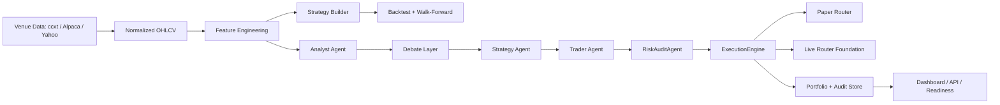

# Pepper

[](https://github.com/NANIEXISTS/pepper/actions/workflows/ci.yml)


Pepper is a production-shaped AI trading platform focused on one thing first: making research, paper trading, and operator decisions hard to fake and easy to audit.

It is designed around a strict path:

- build strategies into typed graphs
- validate them before trusting them
- backtest them with walk-forward inspection
- run them in paper mode behind the same execution engine
- keep live trading disabled until the real-world gate is satisfied

## What Pepper is

Pepper is not a toy "LLM buys candles" repo. It combines:

- deterministic data normalization
- leakage-aware research
- a writable paper-trading control plane
- multi-agent paper-cycle analysis
- mandatory risk gating before every order
- operator auth and audit trails
- inspectable venue capabilities

## What is actually ready

Ready now:

- local or secured paper-mode operation
- scheduled paper jobs and persisted run history
- manual paper orders through the execution engine
- strategy drafting from natural language into a typed graph
- strategy validation and backtesting through the existing research path
- routed market data across `ccxt`, Alpaca, and Yahoo fallback
- operator dashboard review of jobs, runs, trade audit, walk-forward windows, and venue assumptions
- a Live Launch Brief that turns live-readiness state into a client-readable verdict, blockers, proof, and next action
- read-only Polymarket hype radar for mapping public prediction-market attention to Pepper risk context
- prediction-market terminal covering public whale flow, trader leaderboards, resolution-rule risk, CLOB depth, Kalshi comparisons, and source-watch queries
- paper-only Polymarket Profit Hunter that answers whether a one-hour opportunity is tradeable now, with exact blockers when it refuses

Not ready yet:

- live-money deployment
- 14-day and 28-day paper burn-in completion
- exchange permission audit for live credentials
- live capital ramp

That boundary is deliberate. The code path exists for live-routing foundations, but the operational gate is still real.

## Product surface

### Build

- Draft a strategy in plain language
- Compile it into a typed graph with explicit indicators, rules, and risk policy
- Block ambiguous prompts, unsupported indicators, and missing stop-loss rules

### Validate

- Inspect the compiled graph before using it
- Run leakage checks and walk-forward validation
- Review strategy warnings, per-window metrics, and trade samples

### Run

- Execute paper cycles only through the backend execution engine
- Enforce `RiskAuditAgent.run()` before every order
- Persist fills, vetoes, failures, and operator actions

### Watch

- Scan public Polymarket event volume for high-attention narratives
- Map Bitcoin, macro, politics, and geopolitical markets to affected Pepper symbols
- Track public leaderboard PnL snapshots and large public trade flow
- Inspect market-rule ambiguity, UMA dispute markers, deadlines, and source dependencies
- Review order-book spread, depth near mid, thin-book warnings, negative-risk flags, and fillability scores
- Compare related Kalshi markets and mapped liquid underlyings before calling something an arbitrage
- Generate source-monitor queries for official releases, news, X, and Telegram workflows
- Save terminal snapshots and compare wallet PnL, whale flow, rule risk, and book-quality deltas over time
- Run a paper-only one-hour hunter that ranks Polymarket candidates and creates a paper ticket only when liquidity, spread, fillability, rule risk, and directional confirmation pass

## Architecture



## Why this is different

Most GitHub trading repos fail in predictable ways:

- strategy logic leaks into the data layer
- backtests use future information
- UI actions become hidden order paths
- risk checks are bolted on late or bypassed
- live trading gets enabled before paper evidence exists

Pepper is structured to reject those shortcuts.

## Data and venue model

Market-data paths:

- `ccxt` for exchange-grade crypto OHLCV, with capability checks
- Alpaca for equities and crypto market data through async HTTP
- Yahoo as a fallback, not the primary execution-grade source

Execution paths:

- paper router for default operation
- ccxt live-router foundation
- Alpaca live-router foundation

Inspect venue assumptions directly:

- `GET /venues/capabilities`

Review live-readiness state directly:

- `GET /readiness/live-gate` returns a composite `live_capital_allowed` verdict plus the list of `blocking_reasons`. Live capital is only enabled when the verdict is true.
- `GET /readiness/paper-profitability` reports whether the latest 14 distinct UTC days of completed paper runs were net profitable from persisted portfolio equity.
- The dashboard opens with a Live Launch Brief that translates the same verdict into plain language, then keeps readiness attestations and operator evidence available in collapsible workbench sections.

Review public narrative context directly:

- `GET /market-context/polymarket/hype` returns a read-only Polymarket Gamma scan ranked by relevance, 24-hour volume, and liquidity.
- `GET /market-context/polymarket/terminal` returns the full prediction terminal report: hype, wallets, rules, CLOB microstructure, cross-venue candidates, and source-watch queries.
- `POST /market-context/polymarket/terminal/snapshots` saves a terminal report so later runs can produce wallet, flow, rule-risk, and book-quality deltas.
- `GET /market-context/polymarket/terminal/snapshots` and `GET /market-context/polymarket/terminal/delta` expose the saved history and latest change summary.
- `POST /market-context/polymarket/hunter/run` returns a one-hour paper verdict: `TRADE`, `NO_TRADE`, or `INSUFFICIENT_EDGE`. If it says `TRADE`, the payload includes a paper ticket; if not, it includes the exact blockers.
- The dashboard leads with the One-Hour Profit Hunter verdict and keeps raw Hype Radar / Prediction Terminal detail in a collapsible deep dive. These feeds inform research and operator review; they are not hidden live order paths.

## Operator and safety model

Hard invariants:

- no order path exists outside `ExecutionEngine.place_order()`
- no trade bypasses `RiskAuditAgent.run()`
- no prompt executes directly into trading
- no backtest is trusted without leakage checks and walk-forward context
- live trading remains off until the burn-in gate is satisfied in the real world
- the 14-day paper checkpoint must be measured from persisted equity, not operator memory or screenshots
- public hype feeds are operator context only; using them as a model input requires a new experiment window

Auth model:

- `viewer`: read-only API and dashboard access
- `trader`: paper actions
- `admin`: operator-audit inspection

## Quick start

### 1. Install

```powershell
python -m pip install -e .[dev]
```

### 2. Run tests

```powershell
python -m pytest -q
```

### 3. Start Pepper

```powershell
python -m trading_ai.main
```

Then open:

- [http://127.0.0.1:8000/dashboard](http://127.0.0.1:8000/dashboard)
- [http://127.0.0.1:8000/docs](http://127.0.0.1:8000/docs)

## API highlights

Operator:

- `GET /dashboard`
- `GET /dashboard/data`
- `GET /auth/session`
- `GET /config`
- `GET /venues/capabilities`
- `GET /readiness/live-gate`
- `GET /readiness/paper-profitability`
- `GET /readiness/history`
- `POST /readiness/credential-audit`
- `POST /readiness/drawdown-breaker/selftest`
- `POST /readiness/ramp-plan`

Research:

- `GET /market-data/{symbol}`
- `GET /market-context/polymarket/hype`
- `GET /market-context/polymarket/terminal`
- `POST /market-context/polymarket/terminal/snapshots`
- `GET /market-context/polymarket/terminal/snapshots`
- `GET /market-context/polymarket/terminal/delta`
- `GET /features/{symbol}`
- `GET /backtests/ema/{symbol}`
- `POST /strategies/draft`
- `POST /strategies/validate`
- `POST /strategies/backtests`

Paper operations:

- `POST /paper/cycles/{symbol}`
- `GET /paper/jobs`
- `POST /paper/jobs`
- `POST /paper/jobs/{job_id}/start`
- `POST /paper/jobs/{job_id}/pause`
- `POST /paper/jobs/{job_id}/run`
- `GET /paper/runs`
- `POST /paper/orders/manual`

Audit:

- `GET /audit/trades`
- `GET /audit/operators`
- `GET /alerts`
- `GET /portfolio`

## Repo layout

```text
config.yaml
docs/
scripts/
tests/
trading_ai/
  agents/
  alerts/
  api/
  backtesting/
  core/
  data/
  execution/
  features/
  llm/
  orchestration/
  persistence/
  portfolio/
  reinforcement/
  risk/
  strategy_builder/
  venues/
```

## Repo rules

- keep strategy logic out of the data layer
- keep thresholds in `config.yaml`
- keep all network and database I/O async
- keep paper and live behind the same execution engine
- add tests with each module
- do not claim live readiness before the burn-in gate is actually satisfied

## Documentation

- [Architecture](docs/ARCHITECTURE.md)
- [Operational Readiness](docs/OPERATIONAL_READINESS.md)
- [Repo Guide](docs/REPO_GUIDE.md)
- [Changelog](CHANGELOG.md)
